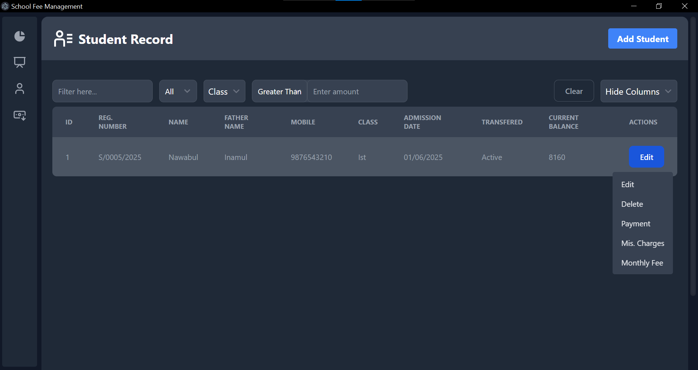
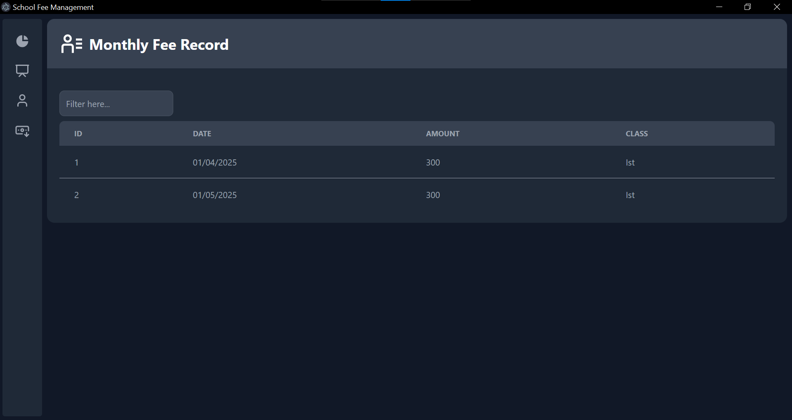

# 🎓 school-fee-management-electronjs

**School Fee Management** is a desktop application built with Electron, React, Drizzle ORM, and SQLite. It automates monthly student fee generation, simplifies payment collection, supports additional charges, and helps school staff track due amounts—everything in a lightweight, offline-first package.

---

## 📌 Features

- ✅ Auto-generate monthly fee records for each student
- ✅ Manually collect payments and add extra charges
- ✅ Instantly view pending dues for any student
- ✅ Works offline with local SQLite database
- ✅ Easy-to-use, clean interface with Flowbite UI

---

## 👨‍🏫 Target Users

This application is designed for **school staff**, such as accountants or principals, who handle fee management operations in small to medium-sized schools.

---

## ⚙️ Tech Stack

- [Electron](https://electron-vite.org/) – Desktop application shell
- [React](https://react.dev/) – Frontend framework
- [Drizzle ORM (SQLite)](https://orm.drizzle.team/docs/get-started-sqlite) – Type-safe local database
- [Tailwind CSS + Flowbite UI](https://flowbite-react.com/docs/getting-started/introduction) – Modern, reusable UI components

---

## 🛠️ Recommended IDE Setup

- [Visual Studio Code](https://code.visualstudio.com/)
  - [ESLint Plugin](https://marketplace.visualstudio.com/items?itemName=dbaeumer.vscode-eslint)
  - [Prettier Plugin](https://marketplace.visualstudio.com/items?itemName=esbenp.prettier-vscode)

---

## 📁 Folder Structure

```
├── src/
│   ├── main/           # Electron main process
│   ├── renderer/       # React frontend (UI)
│   ├── preload/        # bridge
    └── types           # backend ts and utils

```

---

## 🚀 Getting Started

### 📦 Install

```bash
# Install all dependencies
npm install

# Setup Tailwind CSS and Flowbite UI (one-time setup)
npm run scriptinstall
```

> 💡 The `scriptinstall` script automatically configures Tailwind and Flowbite so you're ready to build UI components out of the box.

---

### 🧪 Development

```bash
npm run dev
```

This launches the Electron app in development mode with hot-reload support.

---

### 🏗️ Build

```bash
# For Windows
npm run build:win

# For macOS
npm run build:mac

# For Linux
npm run build:linux
```

Build output will be located in the `release/<platform>/<version>` directory as defined in the build config.

---

## 🔧 Commands Summary

| Command                 | Description                             |
|------------------------|-----------------------------------------|
| `npm install`          | Install dependencies                    |
| `npm run scriptinstall`| Configure Tailwind + Flowbite           |
| `npm run dev`          | Start development environment           |
| `npm run build:win`    | Build for Windows                       |
| `npm run build:mac`    | Build for macOS                         |
| `npm run build:linux`  | Build for Linux                         |

---

## 🤝 Contributing

We welcome contributions from the community!

### How to Contribute

1. Fork this repository
2. Create a new branch from `main`
3. Make your changes and test them locally
4. Ensure your code follows ESLint + Prettier rules
5. Submit a Pull Request with a clear description of your changes

Please feel free to open issues for bugs, feature requests, or suggestions.

---

## 🖼️ Screenshots

### 📋 All Students List


### 📆 One Student's Monthly Fee Records


---

## 📄 License

This project is licensed under a **custom non-commercial license**.
You are free to use, modify, and share the software **for personal and educational purposes only**.

**Commercial use is strictly prohibited without written permission.**
See the [LICENSE](./LICENSE) file for full details.

---

## 🙏 Acknowledgments

Thanks to the developers and open-source tools behind:
- Electron Vite
- Drizzle ORM
- Tailwind CSS
- Flowbite React
